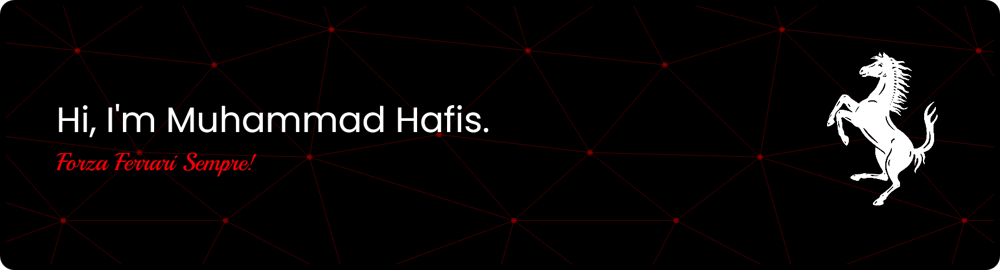

***
 
 ##### Tech Stack
              

***

#####  Connect With Me
 
###

***

#####  For fun
<picture>
  <source media="(prefers-color-scheme: dark)" srcset="https://raw.githubusercontent.com/zahriaan/zahriaan/output/pacman-contribution-graph-dark.svg">
  <source media="(prefers-color-scheme: light)" srcset="https://raw.githubusercontent.com/SkayFive/SkayFive/output/pacman-contribution-graph.svg">
  
</picture>
